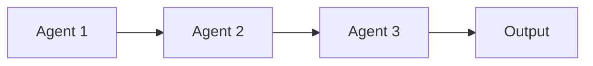
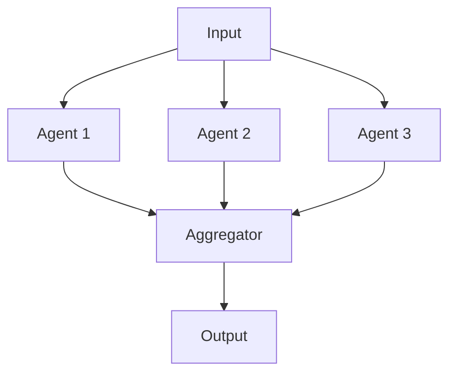
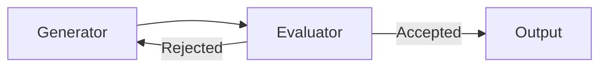
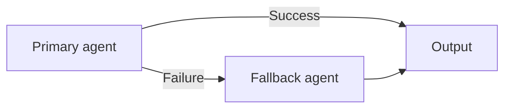

# Multi-Agent Orchestration Patterns

A practical pattern library for structuring how agents interact in multi-agent AI systems.

---

## Why this exists

Many multi-agent systems are built as ad hoc workflows without a clear interaction structure, leading to:

- fragile coordination that breaks under edge cases
- unnecessary complexity and hidden coupling
- unclear fallback behaviour when agents fail
- hard-to-debug control flow

This repository provides reusable orchestration patterns so builders can choose the right interaction model instead of guessing.

---

## Patterns at a glance

### Sequential
Each agent processes output from the previous one. Use when stages are dependent and order matters.

### Parallel with aggregation
Multiple agents run concurrently; results are merged. Use when subtasks are independent.

### Feedback loop
An evaluator reviews output and sends it back for revision. Use when quality thresholds must be met.

### Fallback
A secondary agent handles cases where the primary fails. Use when reliability matters.

---

## What's included

- `patterns/sequential.md` — sequential chaining pattern
- `patterns/parallel.md` — parallel execution with aggregation
- `patterns/feedback-loop.md` — iterative refinement pattern
- `patterns/fallback.md` — failure recovery pattern
- `docs/pattern-selection-guide.md` — decision guide for choosing patterns
- `diagrams/` — Mermaid source files
- `examples/content-research-pipeline.md` — worked multi-pattern example

---

## Who this is for

- Builders of agent pipelines and LLM workflows
- AI product and systems designers
- Teams evaluating orchestration structures before committing to an architecture

---

## Design principle

> A good orchestration pattern reduces design ambiguity and makes the system easier to reason about before it is implemented.

---

## Related repositories

This repository is part of a connected toolkit for responsible AI operations:

| Repository | Purpose |
|-----------|---------|
| [Enterprise AI Governance Playbook](https://github.com/simaba/enterprise-ai-governance-playbook) | End-to-end AI operating model from intake to improvement |
| [AI Release Governance Framework](https://github.com/simaba/ai-release-governance-framework) | Risk-based release gates for AI systems |
| [AI Release Readiness Checklist](https://github.com/simaba/ai-release-readiness-checklist) | Risk-tiered pre-release checklists with CLI tool |
| [AI Accountability Design Patterns](https://github.com/simaba/ai-accountability-design-patterns) | Patterns for human oversight and escalation |
| [Multi-Agent Governance Framework](https://github.com/simaba/multi-agent-governance-framework) | Roles, authority, and escalation for agent systems |
| [Multi-Agent Orchestration Patterns](https://github.com/simaba/multi-agent-orchestration-patterns) | Sequential, parallel, and feedback-loop patterns |
| [AI Agent Evaluation Framework](https://github.com/simaba/ai-agent-evaluation-framework) | System-level evaluation across 5 dimensions |
| [Agent System Simulator](https://github.com/simaba/agent-system-simulator) | Runnable multi-agent simulator with governance controls |
| [LLM-powered Lean Six Sigma](https://github.com/simaba/LLM-powered-Lean-Six-Sigma) | AI copilot for structured process improvement |

---

*Shared in a personal capacity. Open to collaborations and feedback — connect on [LinkedIn](https://linkedin.com/in/simaba) or [Medium](https://medium.com/@bagheri.sima).*
